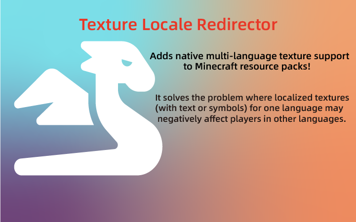

# About Mod Icon Art Resources  

Author: Wulian233  

## Source Files:  

1. `icon.ai`: Created with Adobe Illustrator. It includes a square icon and a
horizontal version with a text title.
2. `text.bbmodel`: A text title model generated using Blockbench's
Minecraft Title Generator plugin.  
3. `dragon-solid.svg`: A free icon sourced from [Font Awesome](https://fontawesome.com/icons/dragon?f=classic&s=solid&pc=%23ffffff&sc=%23ffffff).

## Final Images:  

  

  
